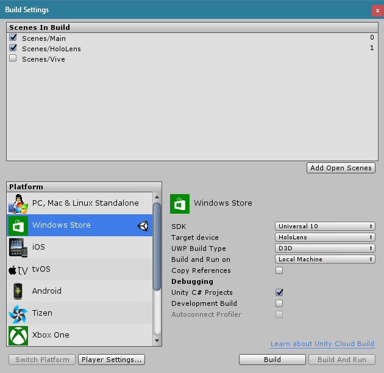

# HoloViveObserver
Observe a VR session from the same room using a HoloLens!

# Building
Open the HoloViveObserver directory using *Unity 5.5.0f3 (64-bit)*.

## Running the Vive (SteamVR) app
To run on the Vive, simply hit the play button at the top of the Unity window.

## Building the HoloLens app
Open the File -> Build Settings menu.

Make sure *Windows Store* is selected. If it isn't, select it and click
*Switch Platform*.

Then click *Build* and select the existing *App* folder. This will export
a Visual Studio project. Yes, you have to do this each time you make changes
within Unity and want to deploy to HoloLens. If you *just* make code changes,
you can skip the Build Settings step and build right from Visual Studio.

Within the *App* folder, open the *Vive Observer.sln* file. Do not be confused
by the HoloViveObserver.sln file in the parent folder, that solution has no
projects.

Once within Visual Studio, select *Release* and target *x86*, then choose
whether you want to deploy to an actual HoloLens or the emulator.

