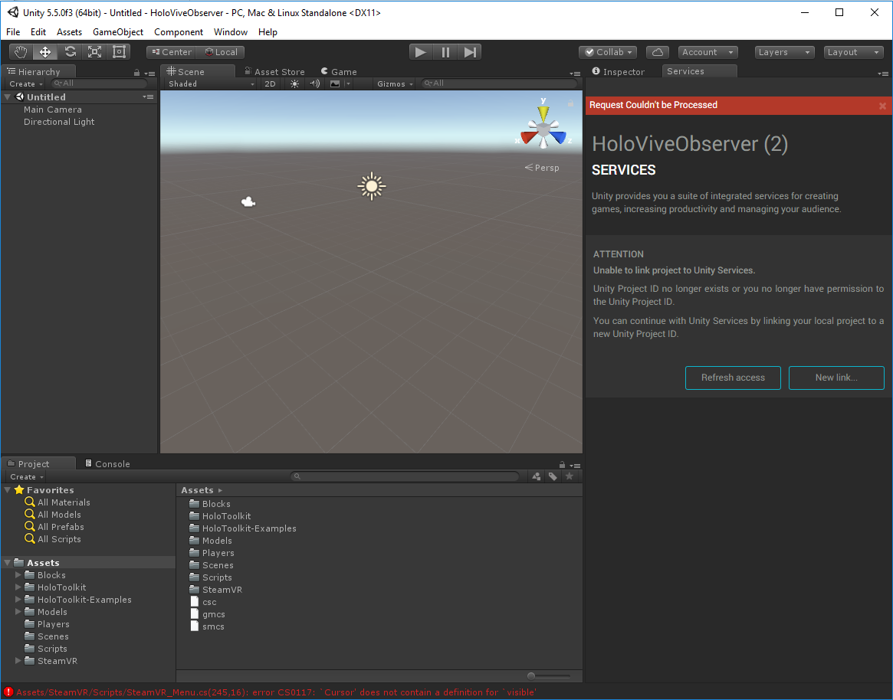
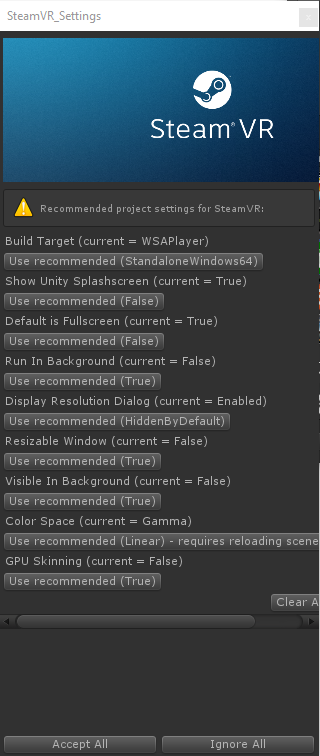
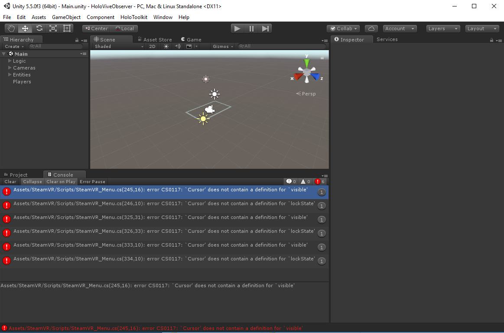

# HoloViveObserver
Observe a VR session from the same room using a HoloLens!

# Building
Open the HoloViveObserver directory using *Unity 5.5.0f3 (64-bit)*.

This project uses Unity's cloud based Multiplayer service.  After opening the project
 go to Window > Services to open the Services tab.  It is important to mention you 
 must be logged into your Unity cloud account within the Unity Editor. (ie. not working offline)
 

Click the *New link...* button in the Services tab. Select your organization name 
(username). Click *Create* button to create a cloud project.  Next click the
Multiplayer service to enable.  Click *Go to dashboard* In a browser if you are
 logged into your Unity account a *Max players per room" field needs to be set as
 2 or more and click save. Finally click <i>Refresh Configuration<\i> and you should
 now see a list of your current configuration settings.
 
## Building the HoloLens app
If you are planning on building for the HoloLens and running the Vive from the same
 machine it is important to build for the HoloLens
first.

Open the File -> Build Settings menu.

Make sure *Windows Store* is selected. If it isn't, select it and click
*Switch Platform*.

Then click *Build* and select the existing *App* folder. This will export
a Visual Studio project. Yes, you have to do this each time you make changes
within Unity and want to deploy to HoloLens. If you *just* make code changes,
you can skip the Build Settings step and build right from Visual Studio.

Within the *App* folder, open the *Vive Observer.sln* file. Do not be confused
by the HoloViveObserver.sln file in the parent folder, that solution has no
projects.

Once within Visual Studio, select *Release* and target *x86*, then choose
whether you want to deploy to an actual HoloLens or the emulator.  

NOTE: When choosing the UWP Build Type as *D3D* the SteamVR_Settings window will pop up.  Simply
leave this window up, DO NOT click *Accept All Settings* or *Ignore All*.  If you do this
the project will not function properly on the HoloLens.

## Running the Vive (SteamVR) app
Open the File -> Build Settings menu.

Make sure *PC, Mac, Linux Standalone* is selected. If it isn't, select it and click
*Switch Platform*.

On the SteamVR_Settings window click *Accept All*

In the Unity Editor several errors will now be presented in the console tab.

To resolve these errors commet out the preprocressor directives shown in the following code blocks
within the SteamVR_Menu.cs file as shown.

Lines 244-247
~~~~
/*# if !UNITY_WSA_10_0
        Cursor.visible = true;
		Cursor.lockState = CursorLockMode.None;
#endif */
~~~~

Lines 324-327
~~~~
/* #if !UNITY_WSA_10_0
		savedCursorVisible = Cursor.visible;
		savedCursorLockState = Cursor.lockState;
#endif */
~~~~

Lines 332-335
~~~~
/* #if !UNITY_WSA_10_0
		Cursor.visible = savedCursorVisible;
		Cursor.lockState = savedCursorLockState;
#endif */
~~~~

Now, hit the play button at the top of the Unity window.

